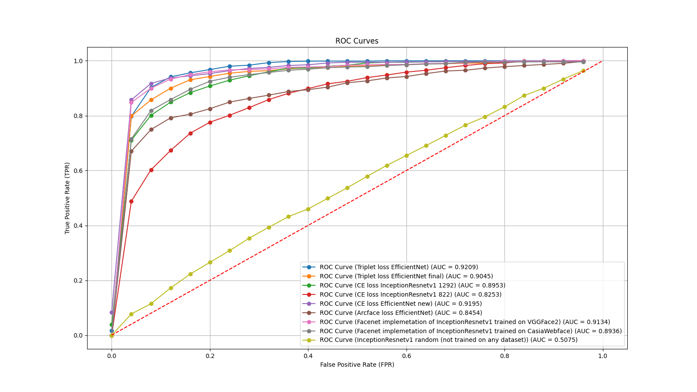
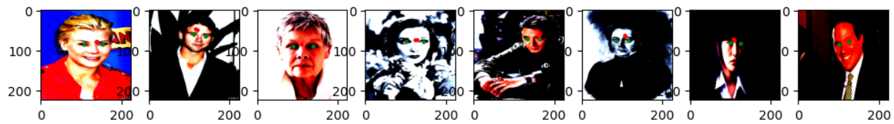
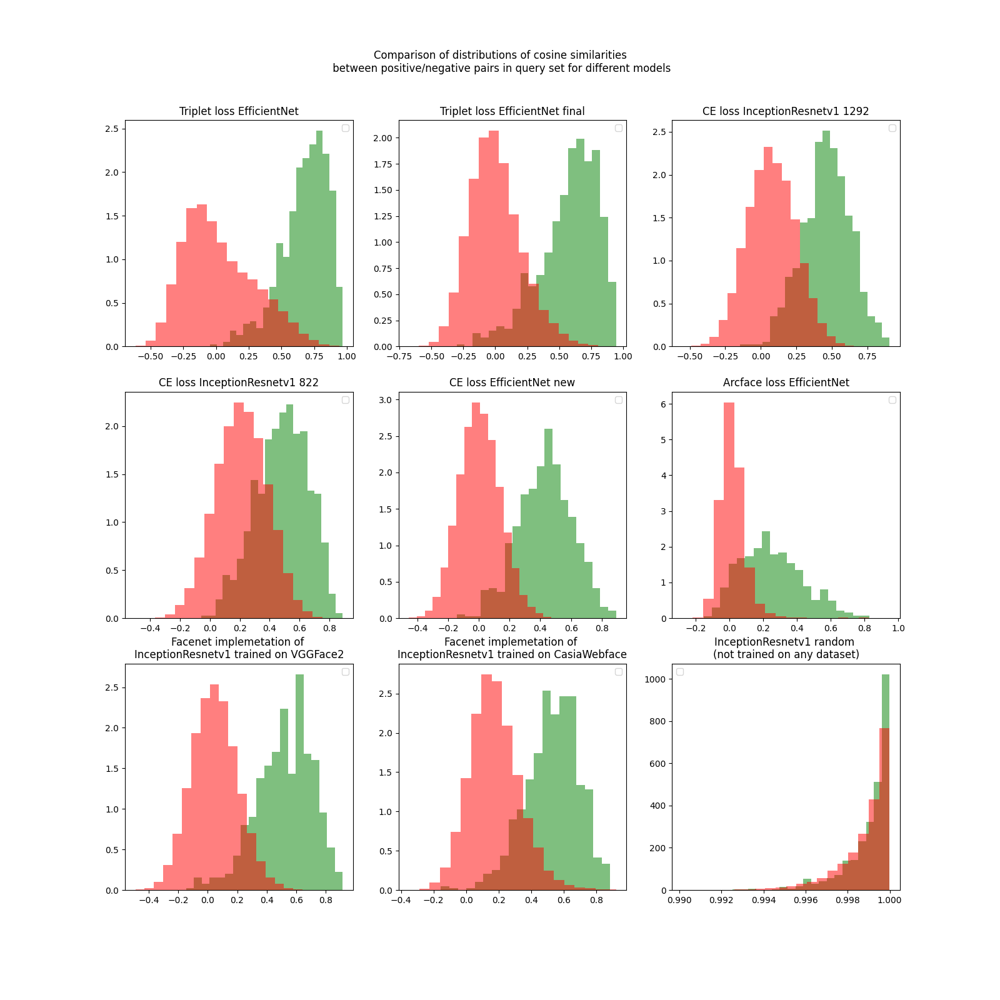
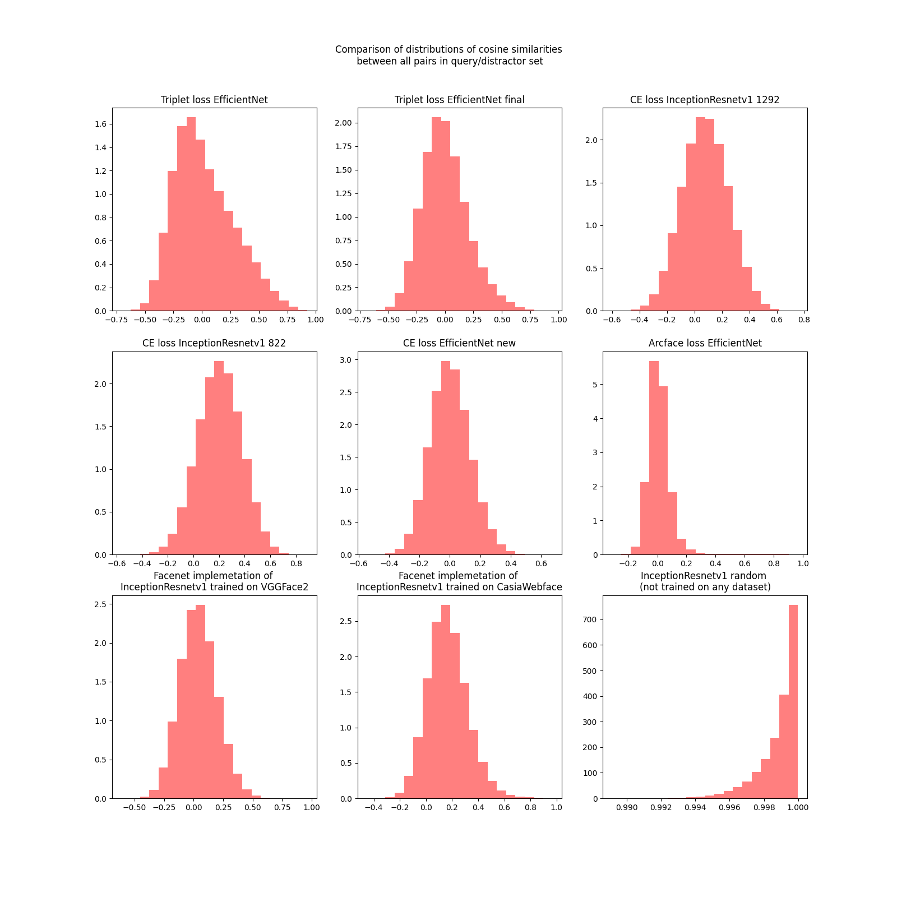

# CGS Final task (Face recognition)

## Pipeline steps:
1. Face detection (MTCNN)
2. Face alignmnent (MTCNN)
3. Face recognition (CE loss: InceptionResnetv1, EfficientNet, Triplet loss: EfficientNet, Arcface loss: EfficientNet)

## Structure of the project:
- **gifs/**: Contains produces gifs
- **people_faces/**: Contains 2 images (Borys and Yurii)
- **id_rate/**: Contains notebook with calculation of ID rate and media files
- **my_face_alignment/**: Contains notebook with my own face alignment model
- **models_definition/**: Contains definition of models
- **notebooks/**: Contains .ipynb with models that I trained
  - **arcface-loss/**: Contains notebook with training of arcface model and produced model as file .pt
  - **ce-loss/**: Contains notebook with training of 2 CE (1 on backbone InceptionResnetv1 and 1 on backbone EfficientNet) model and produced model as file .pt
  - **triplet-loss/**: Contains notebook with training of Triplet model and produced model as file .pt
- **config.py**: config file contains params dict with path of each model
- **face-detection-and-alignment.ipynb**: first and second stages of the pipeline. Contains notebook in which I used MTCNN for face detection and alignment
- **README.md**: Project documentation (this file)
- **utils.py**: Python file contaning helper functions

## Dataset selection and comparison

| Name                                            | Images                             | Identities                                | Size                                     |
|-------------------------------------------------|------------------------------------|-------------------------------------------|------------------------------------------|
| MegaFace (Tightly Cropped)                      | 4,700,000                          | 672,000                                   | 159gb                                    |
| FaceScrub                                       | 106,000                            | 530                                       | 16.5gb                                   |
| LFW                                             | 13,000                             | 1,680                                     | 244mb                                    |
| <span style="color:green;">Casia-WebFace</span> | <span style="color:green;">494,414 | <span style="color:green;">10,575</span>  | <span style="color:green;">2.81gb</span> |
| VGGFace2                                        | 3,300,000                          | 9,000                                     | ~500gb                                   |

* MegaFace ([https://megaface.cs.washington.edu/dataset/download_training.html](https://megaface.cs.washington.edu/dataset/download_training.html))
* FaceScrub ([https://vintage.winklerbros.net/facescrub.html](https://vintage.winklerbros.net/facescrub.html)). Part of MegaFace challenge. Good dataset for training but I don't have enough resources to train on
* LFW ([https://vis-www.cs.umass.edu/lfw/](https://vis-www.cs.umass.edu/lfw/)). Many groups are not well represented in LFW. For example, there are very few children, no babies, very few people over the age of 80, and a relatively small proportion of women. In addition, many ethnicities have very minor representation or none at all. Small dataset to train on but good pick for evaluation
* <span style="color:green;">Casia-WebFace ([https://www.kaggle.com/datasets/debarghamitraroy/casia-webface](https://www.kaggle.com/datasets/debarghamitraroy/casia-webface)). This is diverse dataset with a wide range of ages, ethnicities, and genders. This diversity enables the model to learn more robust facial representations that work across different demographic groups. The best choice for the task. Enough data to train on. I will train models on this dataset></span>
* VGGFace2 ([https://www.robots.ox.ac.uk/~vgg/data/vgg_face2/](https://www.robots.ox.ac.uk/~vgg/data/vgg_face2/)). Good dataset for training but I don't have enough resources to train on

The CasiaWebface dataset consists of 10,575 identities and 494,414 images. But the dataset is highly imbalanced so I trained only on classes that has >= 75 and >= 50 images (1,292 and 822 identities). On 822 identities I trained only 1 model using CrossEntropy loss

## Models that I trained

Let's move to the models that I trained:

### List of models

* Loss: Arcface
  * Backbone: EfficientNet (1292 identities), validation accuracy: 0.8714
* Loss: CrossEntropy:
  * Backbone: EfficientNet (1292 identities), validation accuracy: 0.9082
  * Backbone: InceptionResnetv1 (1292 identities), validation accuracy: 0.8486
  * Backbone: InceptionResnetv1 (822 identities), validation accuracy: 0.8488
* Loss: Triplet
  * Backbone: EfficientNet (1292 identities), validation accuracy: 0.7722

### Calculation of ID rate

But accuracy is only valid metric when we compare models on known identies. If we have unknown identities we need to calculate Identification rate (ID rate)

I also took pretrained Facenet pretrained (InceptionResnetv1 with CrossEntropy loss) models to compare the results and calculated ID rate on this FPR = [0.5, 0.25, 0.1, 0.05, 0.01, 0.005, 0.001] and obtained these results:


| Loss / Backbone                                                    | TPR@FPR=0.5 | TPR@FPR=0.25 | TPR@FPR=0.1 | TPR@FPR=0.05 | TPR@FPR=0.01 | TPR@FPR=0.005 | TPR@FPR=0.001 | ROC-AUC    |
|--------------------------------------------------------------------|-------------|--------------|-------------|--------------|--------------|---------------|---------------|------------|
| Triplet / EfficientNet (min. val loss)                             | **0.999**   | **0.983**    | 0.921       | 0.828        | 0.548        | 0.431         | 0.227         | **0.9209** |
| Triplet / EfficientNet (last epoch)                                | 0.98        | 0.955        | 0.879       | 0.819        | 0.612        | 0.505         | 0.293         | 0.9045     |
| CE / InceptionResnetv1 (num classes=1292)                          | 0.987       | 0.936        | 0.825       | 0.736        | 0.496        | 0.412         | 0.251         | 0.8953     |
| CE / InceptionResnetv1 (num classes=822)                           | 0.933       | 0.808        | 0.643       | 0.528        | 0.287        | 0.224         | 0.119         | 0.8253     |
| CE / EfficientNet                                                  | 0.995       | 0.965        | **0.933**   | **0.872**    | **0.724**    | **0.668**     | **0.516**     | 0.9195     |
| Arcface / EfficientNet                                             | 0.923       | 0.853        | 0.764       | 0.701        | 0.329        | 0.045         | 0.0           | 0.8454     |
| CE / Facenet implemetation of InceptionResnetv1 trained on VGGFace2 | 0.985       | 0.968        | 0.915       | 0.877        | 0.708        | 0.645         | 0.479         | 0.9134     |
| CE / Facenet implemetation of InceptionResnetv1 trained on CasiaWebface | 0.979       | 0.943        | 0.843       | 0.747        | 0.431        | 0.26          | 0.043         | 0.8936     |
| CE / InceptionResnetv1 random (not trained on any dataset)         | 0.561       | 0.315        | 0.141       | 0.088        | 0.023        | 0.015         | 0.004         | 0.5075     |

The best results for each FPR is highlighted with **bold**. On high FPR the best model is Triplet / EfficientNet (min. val loss) and on low it turned CE / EfficientNet to be the best model.

### ROC-AUC curves

I chose FPR in range from [0, 1] with step of of 0.04 and draw ROC-AUC curves for each model:

Model with the highest AUC turned out to be Triplet / EfficientNet (min. val loss) of 0.9202. It's very good results



## Combining of pipeline / Real-time face recognition

Then I combined the whole pipeline (Face detection and face alignment (MTCNN), face recognition (my models)). And wrote script to perform real-time recognition. 

Example of applying pipeline (MTCNN as face detection and alignment, InceptionResnetv1 initialized with random weights and trained using CrossEntropy) to myself. I created directory "people_faces" where there 2 people (Borys and Yurii). 

Using MTCNN I detect and align the images and extract embeddings using my models. The next step is to capture video from webcam. The captured frames are processed by MTCNN (detected, aligned and extract embeddings using my models). Later the embeddings will be compared to the previously extracted embeddings of people in "people_faces" directory and verified.

But firstly let's see how the model only myself.

.gif)

How we can see the model is recognizing me correctly with glaces and hood on. But as I cover my face with hand the mode no longer recognizes me

Now let's try to show on my phone picture of me and my frient Svyatoslav. The model recognize me on the picture and on background and gave the friend text "Undetected" (it's because his photo is not present in people faces directory).


Now let's try how the model behaves when there is two known people (myself and my friend Yurii). Both of us are recognized correctly.


I changed source of video from my webcam to my phone and draw not only bounding boxes but landmarks as well. How we can see I was recognized on the document and on the background as well.


As I step back and turn my head in different directions the model recognizes me and drawing correct bounding boxes and landmarks.


But the model isn't perfect. It recognizes people badly when there are no source of light.


How to use real-time recognition:

Run `real-time-recognition.py`

```
python real-time-recognition.py
    -model_name="ce-inceptionresnetv1-1292"
    -device="cpu"
    -cam=0,
    -people_faces="people_faces"
    -output_path="produced_gif.gif"
    --landmarks
```

`-model_name` - name of the model to use
Available models:
* "arcface-efficientnet"
* "ce-efficientnet"
* "ce-inceptionresnetv1-1292"
* "triplet-efficientnet-last-epoch"
* "triplet-efficientnet-min-val-loss"

`-device` - device to compute ("cpu" or "cuda")

`-cam` - number of webcam to capture video from (I used 0 for my webcam and 1 for video from my iPhone)

`-people_faces` - directory of available people for real-time face recognition

`-output_path` - path for produced gif

`--landmark` - to show face landmarks `--no-landmark` to turn off the drawing of the face landmarks

## My face alignment model

I trained my own face alignment model on LFPW dataset but didn't get very good results:



How we can see the model should produce 2 points of left and right center of the eyes (to calculate angle for face alignment) but rather produce average points of these two points

## Additional:

Comparison of distributions of cosine similarities between positive/negative pairs in query set for different models


Comparison of distributions of cosine similarities between all pairs in query/distractor sets for different models


